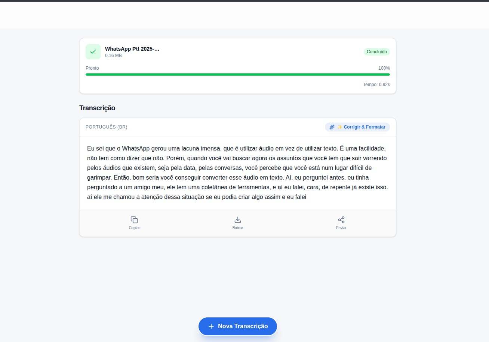
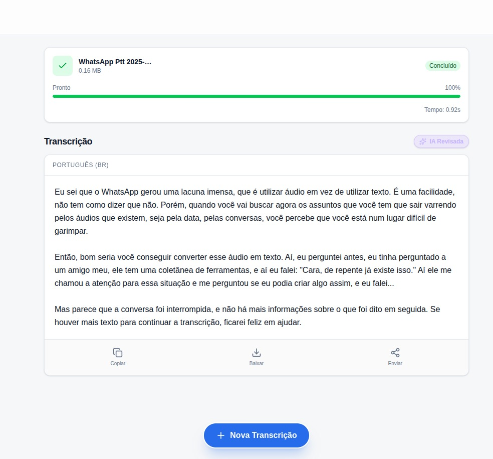

# 🎙️ Audio Scribe


> **Transcrição de áudio ultrarrápida e inteligente.**
> Uma aplicação Fullstack que transforma áudio em texto estruturado em segundos usando o poder das LPUs da Groq (Whisper v3) e refinamento via Llama 3.

## 📸 Screenshots

| Transcrição Bruta (Whisper) | Refinamento com IA (Llama 3) |
|:---:|:---:|
|  |  |

## ✨ Funcionalidades

- 🚀 **Transcrição Instantânea:** Processamento via Groq Cloud (Whisper Large v3) com velocidade extrema (LPUs).
- 🧠 **Refinamento com IA:** Transforma o texto bruto em parágrafos legíveis, adiciona pontuação e corrige gramática (Llama 3.3).
- 🎨 **Design System Moderno:** Interface minimalista e responsiva, construída com Tailwind CSS v4.
- 🌍 **Deploy Híbrido:** Frontend distribuído via CDN (Netlify) e Backend Python em contêiner (Render).
- 🔒 **Segurança:** Variáveis de ambiente protegidas e CORS configurado explicitamente.
- 📱 **Mobile First:** Funciona perfeitamente no celular, com upload de arquivos de voz do WhatsApp.

## 🛠️ Tech Stack

**Frontend (Netlify):**
- [Next.js 15](https://nextjs.org/) (App Router & Server Actions)
- [React 19](https://react.dev/)
- [Tailwind CSS v4](https://tailwindcss.com/) (CSS Variables & Design Tokens)
- [Lucide React](https://lucide.dev/) (Ícones)

**Backend (Render):**
- [Python 3.12](https://www.python.org/)
- [FastAPI](https://fastapi.tiangolo.com/) (Alta performance assíncrona)
- [Groq SDK](https://groq.com/) (Inferência de IA)

## 📂 Arquitetura do Projeto

O projeto segue uma separação clara de responsabilidades:

```mermaid
graph LR
    A["Usuário (Browser)"] -- Upload Audio --> B["Frontend (Next.js)"]
    B -- "POST /transcrever" --> C["Backend (FastAPI)"]
    C -- Arquivo Audio --> D["Groq Cloud (Whisper V3)"]
    D -- Texto Bruto --> C
    C -- Texto Bruto --> B
    B -- "Request Melhoria" --> C
    C -- Prompt --> E["Groq Cloud (Llama 3)"]
    E -- Texto Formatado --> C
    C -- JSON Final --> A
🚀 Como Rodar Localmente
Pré-requisitos
Node.js 18+

Python 3.10+

API Key da Groq Cloud (Gratuita)

1. Backend (Python)
Bash

# Entre na pasta raiz
cd web-transcritor

# Crie um ambiente virtual (Opcional, mas recomendado)
python -m venv venv
source venv/bin/activate  # Linux/Mac
# ou venv\Scripts\activate # Windows

# Instale as dependências
pip install -r requirements.txt

# Crie o arquivo .env
# Adicione: GROQ_API_KEY="sua_chave_aqui"

# Inicie o servidor
uvicorn api:app --reload
# O backend rodará em http://127.0.0.1:8000
2. Frontend (Next.js)
Bash

# Instale as dependências
npm install

# Inicie o servidor de desenvolvimento
npm run dev
Acesse a aplicação em http://localhost:3000.

🎨 Design System & Customização
Este projeto utiliza o novo Tailwind CSS v4. O tema é controlado via variáveis CSS nativas no arquivo src/app/globals.css:

CSS

@theme {
  --color-brand: #136dec;       /* Azul Principal */
  --color-surface-base: #f5f5f7; /* Fundo estilo Apple */
}
🤝 Contribuição
Contribuições são muito bem-vindas!

Fork o projeto

Crie sua Feature Branch (git checkout -b feature/MinhaFeature)

Commit suas mudanças (git commit -m 'Adiciona MinhaFeature')

Push para a Branch (git push origin feature/MinhaFeature)

Abra um Pull Request

📝 Licença
Este projeto está sob a licença MIT.

<div align="center"> Feito com 💙 e muita IA por <a href="https://www.linkedin.com/in/marcos-de-sousa-lima-1a6a6320/">Marcos Lima</a>. </div>